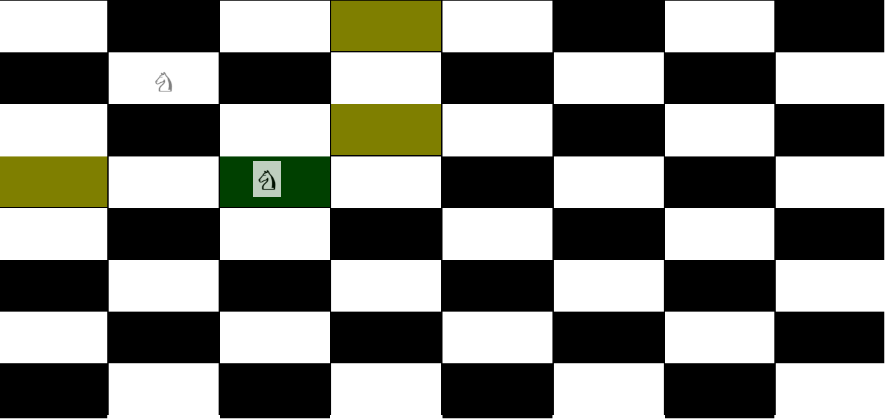
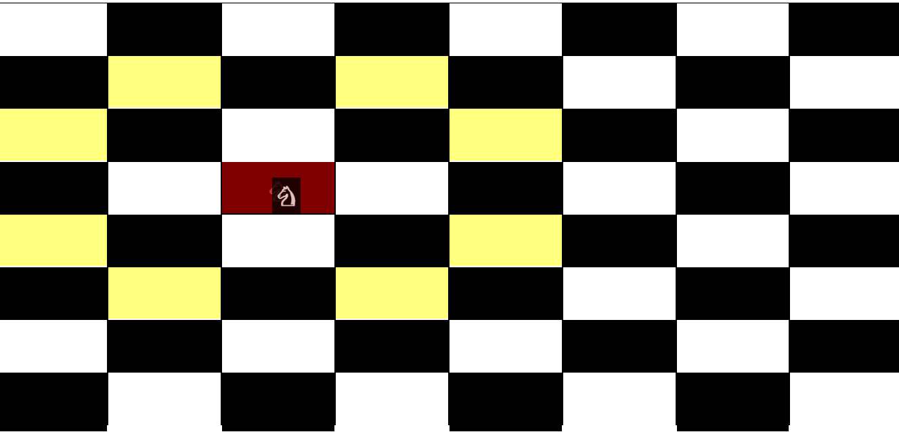

This project was drag and drop using React js with react-dnd, react-dnd-html5-backend

## react-drag-and-drop

In the project directory, you can run:

### `git clone https://github.com/bharatpatil21/react-drag-and-drop.git`

Clone [react-drag-and-drop](https://github.com/bharatpatil21/react-drag-and-drop) repository

### `cd react-drag-and-drop`
### `npm install`

Install all depedancies required to run application

### `npm run start`

Runs the app in the development mode. 
Open [http://localhost:3000](http://localhost:3000) to view it in the browser.

## Output look like

| success move | possible moves  |
|------------|-------------|
|  |  |